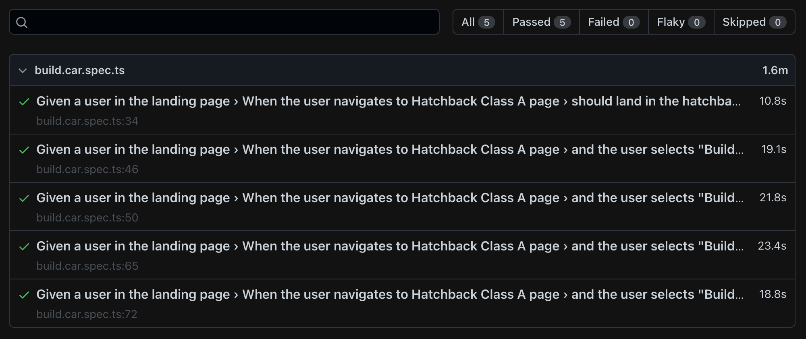

# Playwright Tests for Mercedes-Benz.io

In this repository can be found the end-2-end tests for [Mercedes-Benz.io](https://www.mercedes-benz.co.uk) functionalities.

## Overview

[Playwright](https://playwright.dev/) is a test automation framework and it provides support for writting test cases in BDD/TDD.

The project implements the Page Object Model, a design pattern that creates an object repository for storing all web elements. It is useful in reducing code duplication and improves test case maintenance.

## Setup

### For MAC/Linux users

Install [brew](https://brew.sh/)

```bash
/bin/bash -c "$(curl -fsSL https://raw.githubusercontent.com/Homebrew/install/HEAD/install.sh)"
```

Install [Node.js](https://nodejs.org/en/download/).

```bash
brew install node
```

### Clone repository

Clone the repository to local machine

```bash
git clone https://github.com/lippecruz/wdio_mbenz.git
```

### Install Dependencies

```bash
npm install
```

### Run tests

To execute the test cases please run:

```bash
npm run test
```

### Reports

By default, if any of the tests fail the report will open automatically, otherwise run
```bash
npm run report
```

## Project Structure

```
.
+-- /
| +-- page-objects
| | +-- pages
| | | +-- page.object.name.po.ts
| | +-- components
| | | +-- component.name.po.ts
| +-- tests
| | +-- spec.name.spec.ts
| | +-- ...
| +-- screenhots
| | +-- screeshot.browser.name.png
| | +-- ...
| +-- test-files
| | +-- file.browser.name.txt
| | +-- ...
| +-- tsconfig.json
| +-- playwright.conf.ts
| +-- .env
| +-- package.json
```

### Test Results

Running the tests should result html file which should look similar to this:




## Important Notes
Some files were commited to make it easier the setup (`.env`) or to show evidences of the tests execution (`sreenshots` and `text files`)

The solution is ready to run in different browsers (`chromium`, `firefox` and `webkit`), currently by default it will run all in headless mode (change `.env` file flag to false not run in headless mode).

Only `chromium` is running by default, due to time constraints I was not able to add the required code to select the browser using the .env file, but the tests the only required step is to uncomment the selected browser in the `playwright.config.ts` file.

This challenge was done in Macbook and the following node and npm version:
* node v18.0.0
* npm v8.6.0

